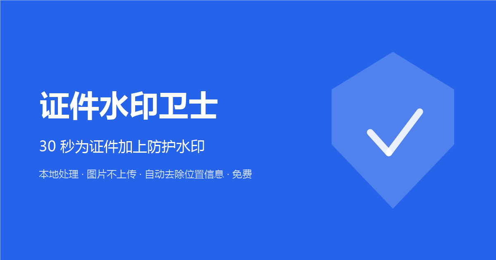

# idmark

[English](README.md) | **简体中文**

> 中文版与英文版（事实源）保持同步，对应英文版 v1.0.0（2026-09-15）。

证件、执照、证书照片对外分享前先加水印——「仅供 XX 平台核验」+ 日期的可见水印，让照片无法被干净地挪作他用。模板化文案、平铺/角标两种形态、批量 20 张，100% 浏览器本地处理，零上传。

[](https://github.com/ikoobee/idmark/actions/workflows/ci.yml)
[](LICENSE)
[](CHANGELOG.md)



## 为什么需要它

裸传证件照做 KYC / 平台入驻是被熟知的盗用途径：图片本身可被二次使用。写明用途与日期的水印让照片在实际意义上「一次性」：

- **用途 + 日期模板**——一键拼接标准防护文案（如「仅供 XX 平台核验使用」+ 当天日期）；预设覆盖常见场景（实名核验、营业执照、房产证、简历照），支持自定义。
- **防裁剪平铺模式**——斜向文字平铺全图，密度 2–10 可调；角标模式提供轻量防护。
- **天然隐私安全**——100% 本地处理，输出经重编码自动去除原 EXIF（含 GPS / 设备信息）。
- **移动端工程保障**——EXIF 方向感知解码、canvas 像素上限防护自动降采样（4800 万像素照片在 iOS 上不会静默白图）、粘贴/拖拽/点击三通道上传、逐张旋转。
- **零依赖、零构建**——原生 ES Module + Canvas，任意静态托管即部署；无账号、无上传、无埋点。

## 快速开始

```bash
git clone https://github.com/ikoobee/idmark.git
cd idmark
npx --yes serve .          # 任意静态文件服务器均可
# 打开 http://localhost:3000 —— 选用途（或试示例图）、生成
```

运行引擎回归测试（Node 18+）：

```bash
npm test
```

## 程序化调用

```js
import { applyWatermark, DEFAULT_CONFIG } from './js/engine.js';

const canvas = applyWatermark(已解码图片, {
  ...DEFAULT_CONFIG,
  text: '仅供 XX 平台核验使用\n2026-09-15',
  mode: 'tile',
  density: 4,
});
```

## 自部署

把 `index.html`、`robots.txt`、`sitemap.xml` 及 `blog/zh/*.html` 的 canonical 中的 `your-domain.example` 替换为你的域名，整个目录丢到任意静态托管即可。统计埋点默认关闭（`js/analytics.js` 中 `provider: 'none'`）。

## 测试

- `tools/test-engine-math.mjs`——引擎纯函数 22 项回归（颜色解析、大图防护契约、code point 安全换行、文件命名、默认值单一来源）。
- [docs/qa-checklist.md](docs/qa-checklist.md)——浏览器侧行为的手工 QA 路径（上传、旋转、导出、i18n）。

## 参与贡献

欢迎 issue 与 PR——见 [CONTRIBUTING.md](CONTRIBUTING.md)。贡献即视为按本项目 MIT 许可证同等授权（inbound = outbound）。

## 许可证

[MIT](LICENSE) © Ethan (ikoobee)
